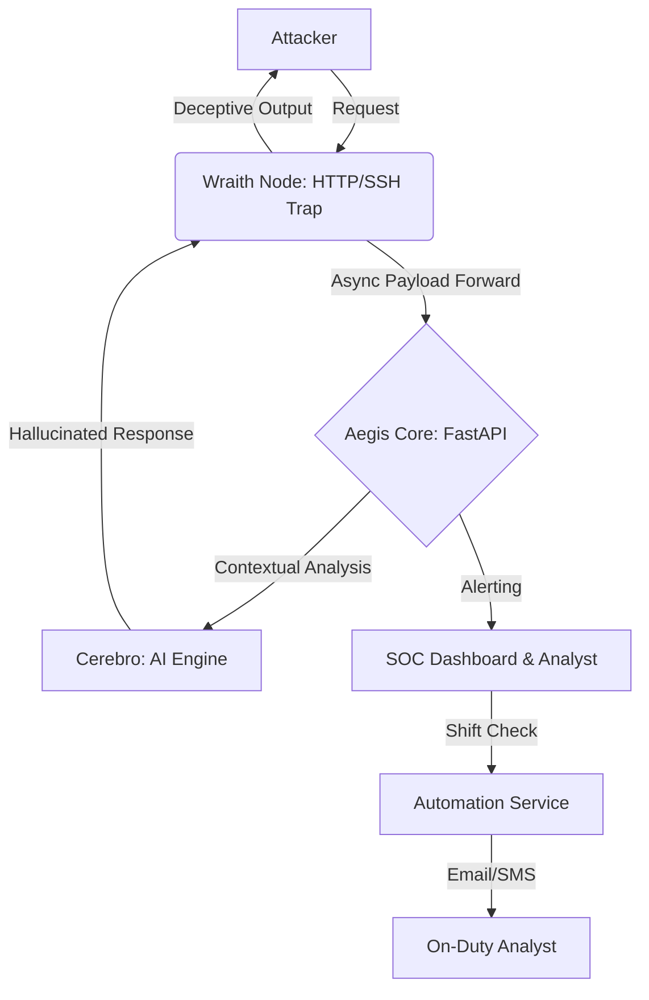

# 🛡️ AegisTrap: The Agentic Cyber-Deception Shield

 
*Note: Representative visualization of the AegisTrap ecosystem.*

---

## 🌌 Sector 1: The Aegis Initiative
**AegisTrap** is a next-generation Cybersecurity Operations Center (SOC) intelligence platform that shifts the paradigm from "Passive Defense" to **"Active Deception"**. 

Traditional honeypots are static, linear, and easily identified by sophisticated attackers. AegisTrap evolves this concept by deploying **Agentic Interceptors**—distributed nodes powered by Large Language Models (LLMs)—that hallucinate complex, stateful, and seemingly vulnerable infrastructures. 

> [!IMPORTANT]
> **Mission Objective**: Exhaust attacker resources, capture high-fidelity threat intelligence, and provide zero-risk environments for live attack analysis.

---

## ⚙️ Sector 2: System Capabilities

### 🧠 Agentic Deception (Powered by Qwen-2.5-7B)
Unlike traditional responses, AegisTrap uses LLMs to generate **non-linear responses**. If an attacker tries to inject SQL, the AI hallucinates a database schema and "leaks" fake data to keep them digging. If they try a Shell injection, they find themselves in a sandboxed, hallucinated terminal.

### 🌪️ The Chaos Engine
Simulate real-world complexity. The project features a dynamic **Instability Factor** that injects system noise, memory address leaks (0x...), and mock connection drops to mimic a failing, high-value target.

### 🕸️ Distributed Wraith Nodes
Multi-node interceptors (Flask-based) that can be spun up across any network. Every probe is forwarded to the **Aegis Core** for AI-driven classification and response strategy.

### ⏲️ IST-Aware Intelligence
Full synchronization with India Standard Time (IST) for precision logging, shift management, and SOC operations.

---

## 🏗️ Sector 3: Hyper-Architecture



---

## 🛠️ Sector 4: Tactical Deployment

### 🛰️ Core Infrastructure (Backend)
1. **Ignite the Brain**:
   ```bash
   cd backend
   pip install -r requirements.txt
   ```
2. **Configure Neural Access**:
   Create a `.env` in `backend/` with your tokens:
   ```env
   HF_TOKEN=your_huggingface_token
   SENDER_EMAIL=alerts@aegistrap.com
   EMAIL_PASSWORD=secure_password
   ```
3. **Launch Sequence**:
   ```bash
   python -m uvicorn app.main:app --reload --port 8000
   ```

### 🛰️ Interface Activation (Frontend)
1. **Initialize Systems**:
   ```bash
   cd frontend
   npm install
   ```
2. **Stabilize UI**:
   ```bash
   npm run dev
   ```

### 🛰️ Trap Deployment (Wraith Node)
1. **Activate Interceptor**:
   ```bash
   python backend/agentic_honeypots/http_trap.py
   ```

---

## 📊 Sector 5: Operations Interface (SOC)

The AegisTrap Dashboard provides:
- **Live Threat Feed**: Real-time visualization of incoming intercepts.
- **Payload Analysis**: Automated classification of SQLi, XSS, and LFI.
- **Analyst Rotations**: Management of on-duty security staff.
- **System Insights**: AI-generated reports on attacker behavior patterns.

---

## 🤝 Sector 6: Defense Collaborative

We welcome contributions to the Aegis Initiative.
- **Attack Flavors**: Define new deception templates in `backend/app/services/attack_flavor.py`.
- **UI Enhancements**: Modernizing the React dashboard using Framer Motion.

---

<p align="center">
  <b>Built for Hackers, by Defenders.</b><br>
  <i>AegisTrap - Where every probe is a ghost.</i>
</p>
